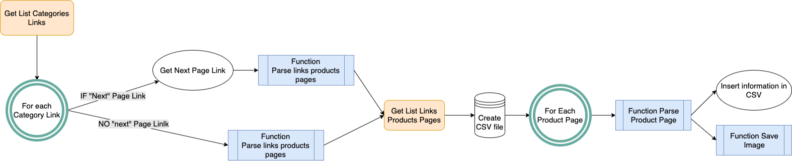

<div id="top"></div>
<!--
*** Thanks for checking out the Best-README-Template. If you have a suggestion
*** that would make this better, please fork the repo and create a pull request
*** or simply open an issue with the tag "enhancement".
*** Don't forget to give the project a star!
*** Thanks again! Now go create something AMAZING! :D
-->


<!-- PROJECT SHIELDS -->
<!--
*** I'm using markdown "reference style" links for readability.
*** Reference links are enclosed in brackets [ ] instead of parentheses ( ).
*** See the bottom of this document for the declaration of the reference variables
*** for contributors-url, forks-url, etc. This is an optional, concise syntax you may use.
*** https://www.markdownguide.org/basic-syntax/#reference-style-links
-->
[![Contributors][contributors-shield]][contributors-url]
[![Forks][forks-shield]][forks-url]
[![Stargazers][stars-shield]][stars-url]
[![Issues][issues-shield]][issues-url]
[![MIT License][license-shield]][license-url]


<!-- PROJECT LOGO -->
<br />
<div align="center">

<h3 align="center">OC - PROJECT N°2 - BOOK TO SCRAPE</h3>

  <p align="center">
    From <a href="https://books.toscrape.com/"> Book To Scrape</a>, get product information of all products pages into a CSV file using Requests, Beautiful Soup, CSV and RE libraries.
    <br />
    <a href="https://github.com/Jliezed/oc_project_2_BookToScrape"><strong>Explore the docs »</strong></a>
    <br />
    <br />
    <a href="https://github.com/Jliezed/oc_project_2_BookToScrape">View Demo</a>
    ·
    <a href="https://github.com/Jliezed/oc_project_2_BookToScrape/issues">Report Bug</a>
    ·
    <a href="https://github.com/Jliezed/oc_project_2_BookToScrape/issues">Request Feature</a>
  </p>
</div>


<!-- TABLE OF CONTENTS -->
<details>
  <summary>Table of Contents</summary>
  <ol>
    <li>
      <a href="#about-the-project">About The Project</a>
      <ul>
        <li><a href="#built-with">Built With</a></li>
      </ul>
    </li>
    <li>
      <a href="#getting-started">Getting Started</a>
      <ul>
        <li><a href="#prerequisites">Prerequisites</a></li>
        <li><a href="#installation">Installation</a></li>
      </ul>
    </li>
    <li><a href="#outputs">Outputs</a></li>
    <li><a href="#contact">Contact</a></li>
    <li><a href="#acknowledgments">Acknowledgments</a></li>
  </ol>
</details>


<!-- ABOUT THE PROJECT -->
## About The Project

Understand the logic with the flowchart below:
- Get a list of `all Categories Links`
- For each `Category Link`
  - Parse <strong>Links Products Pages</strong>
  - IF there is a `"Next"` page then go to this page and parse <strong>Links Products Pages</strong>
  
  
- Create a CSV file


- For each `Product Page`
  - Parse <strong> Products Information</strong>
  - Insert product information in the CSV
  - Save the image of the book




<p align="right">(<a href="#top">back to top</a>)</p>


### Built With

* [Python](https://www.python.org/)
* [Library Requests](https://docs.python-requests.org/en/latest/)
* [Library BeautifulSoup](https://beautiful-soup-4.readthedocs.io/en/latest/)
* [Library CSV](https://docs.python.org/3/library/csv.html)
* [Library RE](https://docs.python.org/3/library/re.html)

<p align="right">(<a href="#top">back to top</a>)</p>


<!-- GETTING STARTED -->
## Getting Started

You will need to install Requests and BeautifulSoup libraries.

### Prerequisites

Install Python libraries before to clone the repo:
* Requests
  ```sh
  pip install requests
  ```
* Beautiful Soup
  ```sh
  pip install bs4
  ```
### Installation & Running the script

1. Clone the repo
   ```sh
   git clone https://github.com/Jliezed/oc_project_2_BookToScrape.git
   ```
2. Install the packages using requirements.txt
   ```sh
   pip install -r requirements.txt
   ```
3. Run the script using the terminal
   ```sh
   python main.py
   ```

<p align="right">(<a href="#top">back to top</a>)</p>


<!-- USAGE EXAMPLES -->
## Outputs

You will get a separate CSV file by category including for each product page :
- product_page_url
- universal_ product_code (upc)
- title
- price_including_tax
- price_excluding_tax
- number_available
- product_description
- category
- review_rating
- image_url

It will also save product image for each product page.

<p align="right">(<a href="#top">back to top</a>)</p>


<!-- CONTACT -->
## Contact

Jliezed

Project Link: [https://github.com/Jliezed/oc_project_2_BookToScrape](https://github.com/Jliezed/oc_project_2_BookToScrape)

<p align="right">(<a href="#top">back to top</a>)</p>


<!-- MARKDOWN LINKS & IMAGES -->
<!-- https://www.markdownguide.org/basic-syntax/#reference-style-links -->
[contributors-shield]: https://img.shields.io/github/contributors/github_username/repo_name.svg?style=for-the-badge
[contributors-url]: https://github.com/github_username/repo_name/graphs/contributors
[forks-shield]: https://img.shields.io/github/forks/github_username/repo_name.svg?style=for-the-badge
[forks-url]: https://github.com/github_username/repo_name/network/members
[stars-shield]: https://img.shields.io/github/stars/github_username/repo_name.svg?style=for-the-badge
[stars-url]: https://github.com/github_username/repo_name/stargazers
[issues-shield]: https://img.shields.io/github/issues/github_username/repo_name.svg?style=for-the-badge
[issues-url]: https://github.com/github_username/repo_name/issues
[license-shield]: https://img.shields.io/github/license/github_username/repo_name.svg?style=for-the-badge
[license-url]: https://github.com/github_username/repo_name/blob/master/LICENSE.txt
[linkedin-shield]: https://img.shields.io/badge/-LinkedIn-black.svg?style=for-the-badge&logo=linkedin&colorB=555
[linkedin-url]: https://linkedin.com/in/linkedin_username
[product-screenshot]: images/screenshot.png