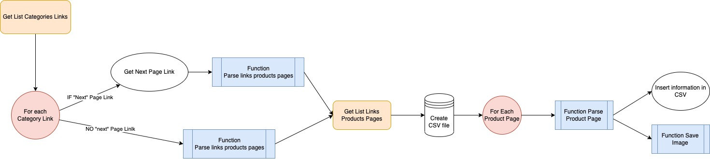

<div id="top"></div>
<!--
*** Thanks for checking out the Best-README-Template. If you have a suggestion
*** that would make this better, please fork the repo and create a pull request
*** or simply open an issue with the tag "enhancement".
*** Don't forget to give the project a star!
*** Thanks again! Now go create something AMAZING! :D
-->


<!-- PROJECT SHIELDS -->
<!--
*** I'm using markdown "reference style" links for readability.
*** Reference links are enclosed in brackets [ ] instead of parentheses ( ).
*** See the bottom of this document for the declaration of the reference variables
*** for contributors-url, forks-url, etc. This is an optional, concise syntax you may use.
*** https://www.markdownguide.org/basic-syntax/#reference-style-links
-->

[![oc-project-shield][oc-project-shield]][oc-project-url]
[![web-scraping-shield][web-scraping-shield]][oc-project-url]
[![beautiful-soup-shield][beautifulsoup-shield]][oc-project-url]


<!-- PROJECT LOGO -->
<br />
<div align="center">

<h3 align="center">OC - PROJECT N°2 - BOOK TO SCRAPE</h3>

  <p align="center">
    From <a href="https://books.toscrape.com/"> Book To Scrape</a>, get product information of all products pages into a CSV file using Requests, Beautiful Soup, CSV and RE libraries.
    <br />
</p>
</div>


<!-- ABOUT THE PROJECT -->
## About The Project

Understand the logic with the flowchart below:
- Get a list of `all Categories Links`
- For each `Category Link`
  - Parse <strong>Links Products Pages</strong>
  - IF there is a `"Next"` page then go to this page and parse <strong>Links Products Pages</strong>
  
  
- Create a CSV file


- For each `Product Page`
  - Parse <strong> Products Information</strong>
  - Insert product information in the CSV
  - Save the image of the book




<p align="right">(<a href="#top">back to top</a>)</p>


### Built With

* [Python](https://www.python.org/)
* [Library Requests](https://docs.python-requests.org/en/latest/)
* [Library BeautifulSoup](https://beautiful-soup-4.readthedocs.io/en/latest/)
* [Library CSV](https://docs.python.org/3/library/csv.html)
* [Library RE](https://docs.python.org/3/library/re.html)

<p align="right">(<a href="#top">back to top</a>)</p>


<!-- GETTING STARTED -->
## Getting Started

You will need to install Requests and BeautifulSoup libraries.

### Prerequisites

Install Python libraries before to clone the repo:
* Requests
  ```sh
  pip install requests
  ```
* Beautiful Soup
  ```sh
  pip install bs4
  ```
### Installation & Running the script

1. Clone the repo
   ```sh
   git clone https://github.com/Jliezed/oc_project_2_BookToScrape.git
   ```
#### Create and activate a virtual environment
2. Go to your project directory
   ```sh
   cd /oc_project_2_BookToScrape
   ```
3. Install venv library (if not yet in your computer)
   ```sh
   pip install venv
   ```
4. Create a virtual environment
   ```sh
   python -m venv env
   ```
5. Activate the virtual environment
   ```sh
   source env/bin/activate
   ```
---
6. Install the packages using requirements.txt
   ```sh
   pip install -r requirements.txt
   ```
7. Run the script using the terminal
   ```sh
   python main.py
   ```


<p align="right">(<a href="#top">back to top</a>)</p>


<!-- USAGE EXAMPLES -->
## Outputs

You will get a separate CSV file by category including for each product page :
- product_page_url
- universal_ product_code (upc)
- title
- price_including_tax
- price_excluding_tax
- number_available
- product_description
- category
- review_rating
- image_url

It will also save product image for each product page.

<p align="right">(<a href="#top">back to top</a>)</p>


<!-- MARKDOWN LINKS & IMAGES -->
<!-- https://www.markdownguide.org/basic-syntax/#reference-style-links -->
[oc-project-shield]: https://img.shields.io/badge/OPENCLASSROOMS-PROJECT-blueviolet?style=for-the-badge
[web-scraping-shield]: https://img.shields.io/badge/-WEB%20SCRAPING-blue?style=for-the-badge
[beautifulsoup-shield]: https://img.shields.io/badge/-BEAUTIFULSOUP-blue?style=for-the-badge
[oc-project-url]: https://openclassrooms.com/fr/paths/518-developpeur-dapplication-python
